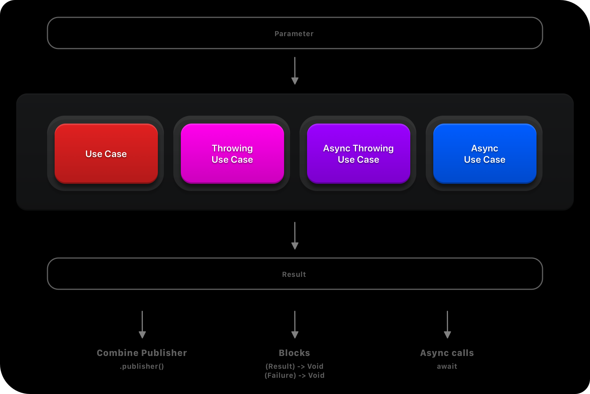

# SwiftUseCase

[](https://github.com/xtro/SwiftUseCase/actions/workflows/swift.yml)  [](https://github.com/apple/swift-package-manager)  

**SwiftUseCase** is library for creating independent & coverable usecases with a powerfull execution api.

## Installation
You can use Swift Package Manager to integrate the library by adding the following dependency in your Package.swift file or by adding directly within Xcode:

```swift
.Package(url: "https://github.com/xtro/SwiftUseCase.git", majorVersion: 1)
```

## Definitions

A UseCase is a process where ``Parameter`` is transforming into ``Result`` by executing an ``Execution``. 
```swift
public protocol UseCaseable {
    associatedtype Parameter: Sendable
    associatedtype Result: Sendable
    associatedtype Execution: Sendable
    var execute: Execution { get }
}
```

There are four types of executions:
```swift
public typealias Executable<Parameter: Sendable, Result: Sendable> = @Sendable (Parameter) -> Result
public typealias AsyncExecutable<Parameter: Sendable, Result: Sendable> = @Sendable (Parameter) async -> Result
public typealias ThrowingExecutable<Parameter: Sendable, Result: Sendable> = @Sendable (Parameter) throws -> Result
public typealias AsyncThrowingExecutable<Parameter: Sendable, Result: Sendable> = @Sendable (Parameter) async throws -> Result
```



## Getting started
In this example we implement a data task using swift concurrency. The parameters are an URLRequest and an URLSession:
```swift
import SwiftUseCase

public enum Network {
    public struct DataTask: AsyncThrowingUseCase {
        public struct Parameter {
            let request: URLRequest
            let session: URLSession
        }
        public typealias Result = (response: HTTPURLResponse, data: Data)
        
        public var execute: AsyncThrowingExecutable<Parameter, Result> = { parameter in
            class CancellableWrapper {
                var dataTask: URLSessionDataTask?
            }
            let urlSessionTask = CancellableWrapper()
            return try await withTaskCancellationHandler {
                return try await withUnsafeThrowingContinuation { continuation in
                    urlSessionTask.dataTask = parameter.session.dataTask(with: parameter.request) { data, response, error in
                        if let error = error {
                            continuation.resume(throwing: error)
                        }
                        if let data = data {
                            let result = (response as! HTTPURLResponse, data)
                            continuation.resume(returning: result)
                        }
                    }
                    urlSessionTask.dataTask?.resume()
                }
            } onCancel: {
                urlSessionTask.dataTask?.cancel()
            }
        }
    }
}
```

After that we can use the implemented code in many ways. 

Use as a combine publisher:
```swift
let usecase = Network.DataTask()
usecase.publisher(
    .init(
        request: URLRequest(url: URL(string: path)!),
        session: session ?? .shared
    )
)
```

It looks nice, but the parameter and initialization is too complex in this case, we can reduce it by writing an extension like this:

```swift
extension Network.DataTask.Parameter {
    static func get(_ path: String, session: URLSession? = nil) -> Self {
        .init(
            request: URLRequest(url: URL(string: path)!),
            session: session ?? .shared
        )
    }
}
extension Network {
    static var dataTask: DataTask {
        DataTask()
    }
}
```

much better, now we can use as a Combine publisher:
```swift
Network.dataTask
    .publisher( .get("https://api.coincap.io/v2/assets") )
    ...
```
or using blocks:
```swift
Network.dataTask( .get("https://api.coincap.io/v2/assets") ) { result in
   ...
}
```

or in swift concurrency:
```swift
let result = try await Network.dataTask( .get("https://api.coincap.io/v2/assets") )
```

finally every UseCase is convertable to ``AnyUseCase`` a type-erased representation of a usecase:
```swift
let usecase = MyUseCase().eraseToAnyUseCase
usecase.onComplete = {
    print("Result: \($0)")
}
usecase.onFailure = {
    print("Failure: \($0)")
}
usecase(parameter)
```

## Sponsors
SwiftUseCase is an MIT-licensed open source project with its ongoing development made possible entirely by the support of awesome backers. If you'd like to join them, please consider sponsoring this development.

## Contributing
Pull requests are welcome. For major changes, please open an issue first
to discuss what you would like to change.

Please make sure to update tests as appropriate.

## License
This library is released under the [MIT](https://choosealicense.com/licenses/mit/) license. See LICENSE for details.
